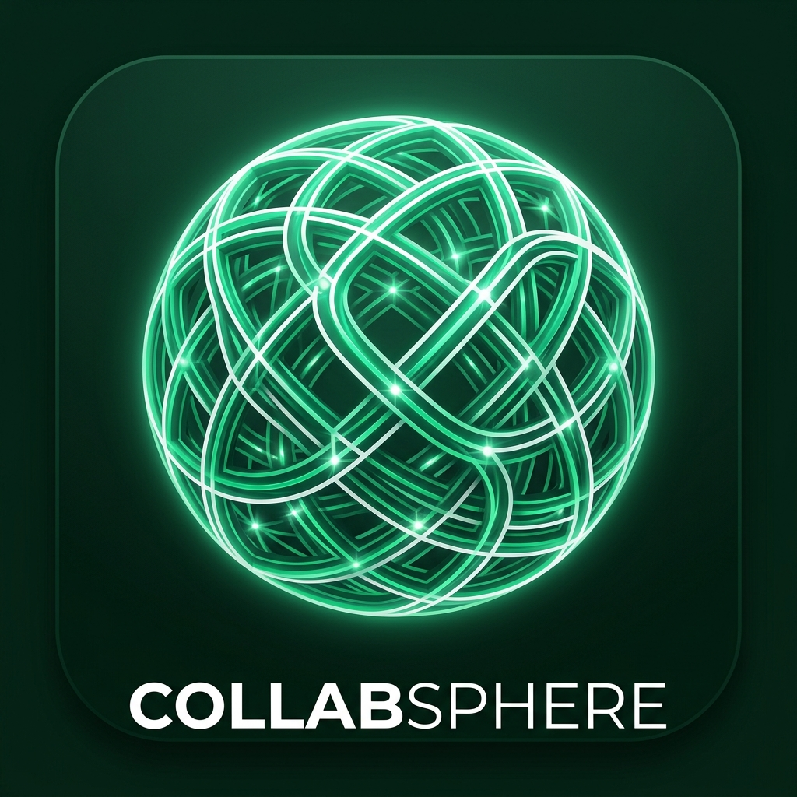

<div align="center">
  
  <h1>CollabSphere</h1>
  <p>A professional community platform for engineers, designers, and product thinkers.</p>
</div>

---

CollabSphere is a full-stack microservices application with a React SPA, Spring Boot, Go, Python, and Node.js backend services, Eureka discovery, Kafka events, PostgreSQL, MongoDB, and Neo4j — all runnable locally with a single command.

## Quick Start

```bash
git clone <repo-url> CollabSphereApp
cd CollabSphereApp

cp .env.local.example .env.local   # fill in local-only credentials

./scripts/local-dev.sh start       # starts infra + all services + UI (~10 min first run)
./scripts/local-dev.sh seed        # loads demo spheres, users, and posts
```

Open **http://localhost:3000**.

- If `SEED_DEFAULT_PASSWORD` is set in `.env.local`, sign in as `admin@example.com` with that password.
- If `SEED_DEFAULT_PASSWORD` is blank, create an account from the signup screen.

→ **Full setup walkthrough:** [setup.md](setup.md)  
→ **Command reference:** [scripts/To-Use.md](scripts/To-Use.md)  
→ **Test accounts & demo data:** [test-data.md](test-data.md)

---

## What Runs Locally

| Layer | Service | Port | Stack | Purpose |
|---|---|---:|---|---|
| UI | `collabsphere-ui` | 3000 | React + Vite | SPA |
| Gateway | `api-gateway` | 8007 | Spring Cloud Gateway | API routing and JWT validation |
| Discovery | `discovery-server` | 8761 | Spring Boot (Eureka) | Service registry |
| Backend | `user-service` | 9020 | Java (Spring Boot) | Signup, login, JWT issuing |
| Backend | `posts-service` | 9010 | Java (Spring Boot) | Feed, posts, likes, comments |
| Backend | `connections-service` | 9030 | Java (Spring Boot) | People search and social graph |
| Backend | `notification-service` | 9070 | Python (FastAPI) | Kafka-backed notifications |
| Backend | `messages-service` | 8010 | Go (Gin) | Direct message API |
| Backend | `spheres-service` | 8009 | Node.js (Express) | Community spheres |
| Data | PostgreSQL | 5432 | — | Users, posts, notifications, spheres |
| Data | MongoDB | 27017 | — | Direct messages |
| Data | Neo4j | 7474 / 7687 | — | Connections social graph |
| Events | Kafka | 9092 | — | Service lifecycle events |
| Events | Schema Registry | 8081 | — | Avro schema management |

---

## Architecture

```
Browser
  └─> collabsphere-ui  :3000
        └─> /api/* proxy
              └─> api-gateway  :8007
                    ├─> user-service              :9020  Java    (PostgreSQL)
                    ├─> posts-service             :9010  Java    (PostgreSQL)
                    ├─> connections-service       :9030  Java    (Neo4j)
                    ├─> notification-service      :9070  Python  (PostgreSQL + Kafka consumer)
                    ├─> messages-service         :8010  Go      (MongoDB)
                    └─> spheres-service           :8009  Node.js (PostgreSQL)

All services register with discovery-server (Eureka) :8761.
Kafka carries post-created, post-liked, and connection events.
```

Authenticated backend routes validate the bearer JWT at the gateway and again inside the receiving service. The gateway strips any caller-supplied `X-User-Id`; services derive the caller identity from the signed JWT instead of trusting identity headers.

---

## Current Setup Notes

- `.env.local` is the only file you should edit for local credentials. It is gitignored.
- Service-level `.env` files for Go, Python, and Node services are generated by `scripts/local-dev.sh` from `.env.local`.
- `docker-compose.local.yml` fails fast when required credentials are missing instead of starting databases with default passwords.
- User seeding is opt-in. Set `SEED_DEFAULT_PASSWORD` to create the demo accounts; leave it blank to start with no seeded users.
- Build artifacts, dependencies, logs, generated service env files, and local runtime state are ignored.

---

## Main Commands

```bash
./scripts/local-dev.sh start           # Start infra, all services, and UI
./scripts/local-dev.sh start --no-ui   # Start backend only
./scripts/local-dev.sh seed            # Load demo data (run after first start)
./scripts/local-dev.sh status          # Show every service status
./scripts/local-dev.sh logs <service>  # Tail one service log
./scripts/local-dev.sh ui start|stop   # Manage the React UI independently
./scripts/local-dev.sh stop            # Stop app services, keep Docker infra
./scripts/local-dev.sh stop --infra    # Stop everything
./scripts/local-dev.sh restart         # Full stop then start
```

---

## API Routes

The UI calls `/api/v1/**`; Vite proxies those to `api-gateway` at `:8007`.

| Frontend path | Routed to | Auth |
|---|---|:---:|
| `/api/v1/users/auth/signup` | `user-service` | No |
| `/api/v1/users/auth/login` | `user-service` | No |
| `/api/v1/posts/**` | `posts-service` | ✓ |
| `/api/v1/likes/**` | `posts-service` | ✓ |
| `/api/v1/connections/**` | `connections-service` | ✓ |
| `/api/v1/notifications/**` | `notification-service` | ✓ |
| `/api/v1/messages/**` | `messages-service` | ✓ |
| `/api/v1/spheres/**` | `spheres-service` | ✓ |

---

## Data And Events

| Data/Event | Producer | Consumer |
|---|---|---|
| Users | `user-service` | `connections-service`, `spheres-service` seed |
| Posts and likes | `posts-service` | `notification-service` via Kafka |
| Connections | `connections-service` | `posts-service` feed visibility, `notification-service` via Kafka |
| Notifications | `notification-service` | React notifications page |
| Messages | `messages-service` | React messages page |
| Spheres | `spheres-service` | React spheres page |

Kafka topics are created by the services as needed for post, like, user-created, and connection events. Schema Registry is used for Avro payloads in the Java services.

---

## Repository Layout

```
api-gateway/              Spring Cloud Gateway — routing and JWT validation
discovery-server/         Eureka service registry
user-service/             Java — auth, signup, login, JWT issuing
posts-service/            Java — feed, posts, likes, comments
connections-service/      Java — Neo4j social graph (people, connections, requests)
notification-service/     Python (FastAPI) — Kafka consumer, push notifications
messages-service/         Go (Gin) — direct messaging backed by MongoDB
spheres-service/          Node.js (Express) — community spheres, posts, comments, votes
collabsphere-ui/          React 18 + Vite 6 SPA
scripts/
  local-dev.sh            Full-stack local orchestrator (start/stop/seed/status/logs)
  db-init/                PostgreSQL first-boot database creation script
.env.local.example        Environment variable template
setup.md                  From-scratch setup guide
test-data.md              Seeded user accounts and demo content reference
```

> Build artifacts (`target/`, `dist/`), dependencies (`node_modules/`), runtime data (`.local-dev/`), and local secrets (`.env.local`) are gitignored.

---

## Tech Stack

| Layer | Technologies |
|---|---|
| Frontend | React 18, React Router 7, Vite 6, Geist + Inter fonts |
| Backend (Java) | Spring Boot 3, Spring Cloud Gateway, Spring Data JPA, Spring Data Neo4j, Spring Kafka |
| Backend (Go) | Go 1.22, Gin, MongoDB driver, golang-jwt |
| Backend (Python) | Python 3.13, FastAPI, asyncpg, aiokafka, fastavro, python-jose |
| Backend (Node.js) | Express 4, node-postgres (pg), jsonwebtoken |
| Databases | PostgreSQL 16, Neo4j 5, MongoDB 7 |
| Messaging | Apache Kafka, Confluent Schema Registry, Avro |
| Discovery | Netflix Eureka |
